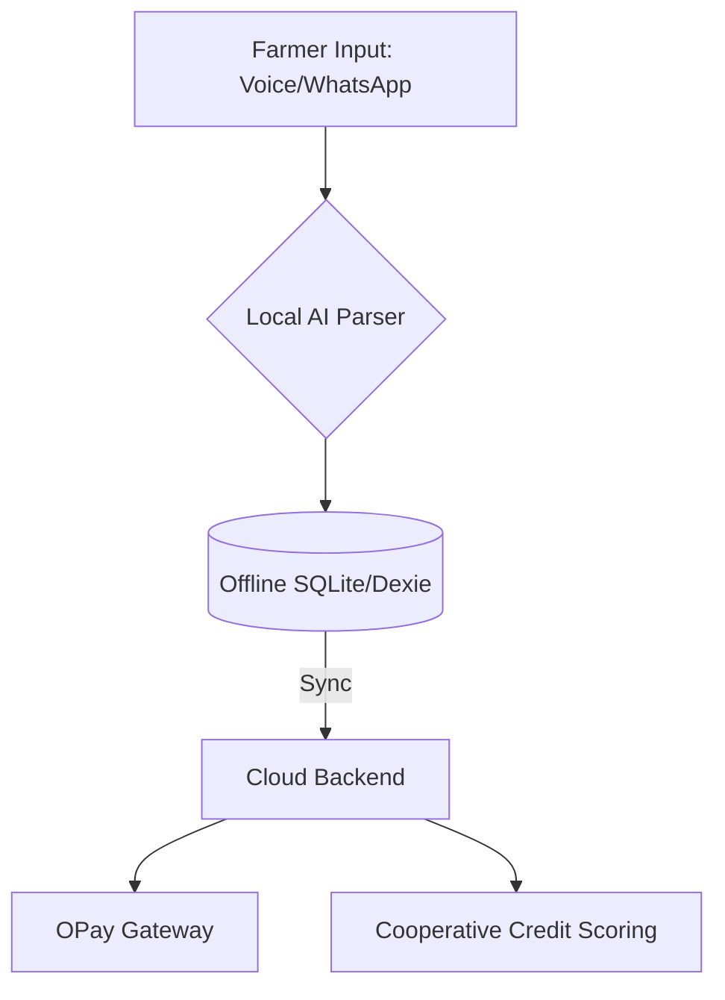

# AgroVoice: Empowering Nigeria's Smallholder Farmers

AgroVoice is a production-ready, offline-first Agrifintech platform designed to bridge the gap between Nigeria's unbanked smallholder farmers and modern financial systems. 

## The Problem
Smallholder farmers, who produce the majority of Nigeria's food, face critical barriers:
*   **Financial Exclusion:** Limited access to credit and formal payment systems.
*   **The Digital Divide:** Poor internet connectivity hinders the use of traditional cloud-based tools.
*   **Literacy Barriers:** Language and technical complexity prevent farmers from adopting digital tools.

## The Solution
AgroVoice provides a seamless, **offline-first digital ledger** that works in rural environments and synchronizes when connectivity is restored.

### Key Features
*   **Offline-First:** Built on `Dexie.js`/SQLite to ensure no data loss in areas with poor internet.
*   **Local AI Input:** Uses `Transformers.js` to parse voice/text transactions locally.
*   **Dynamic Fintech Core:** Multi-modal credit scoring based on transactional history and cooperative participation.
*   **Payment Integration:** Extensible payment gateway abstraction (Paystack/Flutterwave).
*   **Accessibility (USSD):** USSD fallback for feature phones, enabling credit checking, market price queries, and transaction logging.
*   **Market Intelligence:** Real-time price aggregation service for crops.

## Architecture

## Impact
AgroVoice directly addresses productivity and financial inclusion, turning traditional farming into data-driven, bankable enterprises.
