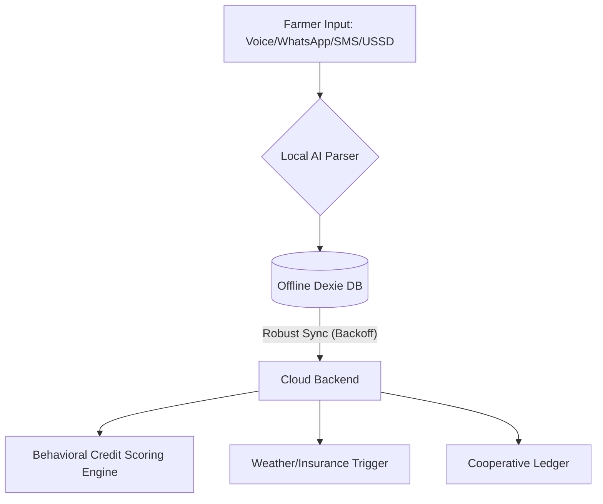

# AgroVoice: Empowering Nigeria's Smallholder Farmers

AgroVoice is a production-ready, offline-first AgriFinTech platform designed to bridge the gap between Nigeria's unbanked smallholder farmers and modern financial systems. 

## The Problem
Smallholder farmers, who produce the majority of Nigeria's food, face critical barriers:
*   **Financial Exclusion:** Limited access to credit and formal payment systems.
*   **The Digital Divide:** Poor internet connectivity hinders the use of traditional cloud-based tools.
*   **Literacy Barriers:** Language and technical complexity prevent farmers from adopting digital tools.

## The Solution
AgroVoice provides a seamless, **offline-first digital ledger** that works in rural environments, offering inclusive financial and agricultural services.

### World-Class AgriFinTech Features
*   **Offline-First Resilience:** Local database logging with exponential backoff synchronization for areas with 2G/3G coverage.
*   **Inclusive Access:** USSD and SMS fallback gateways enable offline transaction logging and market intelligence queries for feature phone users.
*   **Multilingual Support:** Full interface localization support for Hausa, Yoruba, Igbo, and Pidgin.
*   **AI-Driven Behavioral Credit Scoring:** Dynamic credit scoring based on transaction history, making farmers bankable for formal micro-finance.
*   **Localized Weather Risk Assessment:** Automated monitoring and micro-insurance trigger framework based on LGA-specific weather thresholds.
*   **Market Intelligence:** Real-time crop market price aggregation.

## Architecture

## Impact
AgroVoice directly addresses productivity, financial inclusion, and risk mitigation, turning traditional farming into data-driven, bankable, and resilient enterprises.
